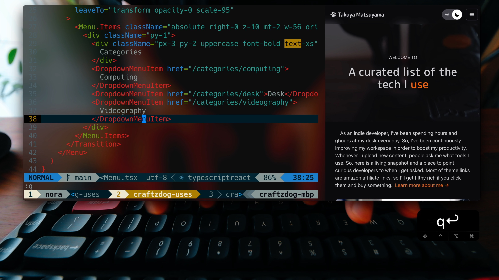

# Takuya's curated list of the tech

A curated list of the tech I use, built with Astro and Tailwind CSS

https://uses.craftz.dog/

## Tutorial

Watch how I built this website on YouTube:

[](https://youtu.be/3_JE76PKBWE)

<https://youtu.be/3_JE76PKBWE>

## Stack

- [Astro](https://astro.build/) - Static Website Framework
- [Tailwind CSS](https://tailwindui.com/) - CSS Framework
- [React](https://reactjs.org/) - Component-based UI framework for JS
- [Headless UI](https://headlessui.com/) - Unstyled interactive components
- [React Icons](https://react-icons.github.io/react-icons/) - Icon set
- [Inkdrop](https://www.inkdrop.app/) - Markdown note-taking app, for writing the blog content (optional)

## Project Structure

Inside of your Astro project, you'll see the following folders and files:

```
PROJECT_ROOT
├── public              # static assets
│   └── posts           # images of posts
├── src
│   ├── components      # Astro & React components
│   │   └── icons
│   ├── layouts         # page layouts
│   ├── pages           # page files
│   │   ├── categories  # category pages
│   │   └── posts       # .md files
│   └── styles          # global stylesheets
└── tools               # Inkdrop integration
```

## How to import notes from your Inkdrop local server

First, please check out the [live-export](https://github.com/inkdropapp/inkdrop-live-export) documentation.

Create `.env` file as following:

```
DEBUG='inkdrop:export:info,inkdrop:export:error'
INKDROP_USERNAME='***'
INKDROP_PASSWORD='***'
INKDROP_PORT=***
INKDROP_BOOKID='***'
```

Then, run the following command:

```sh
npm run live-import
```

## License

MIT License.

You can create your own homepage for free without notifying me by forking this project under the following conditions:

- Delete my blog content and assets
- Add a link to [my homepage](https://www.craftz.dog/)

---

Looking for a Markdown note-taking app? Check out my app called Inkdrop:

[](https://www.inkdrop.app/)
